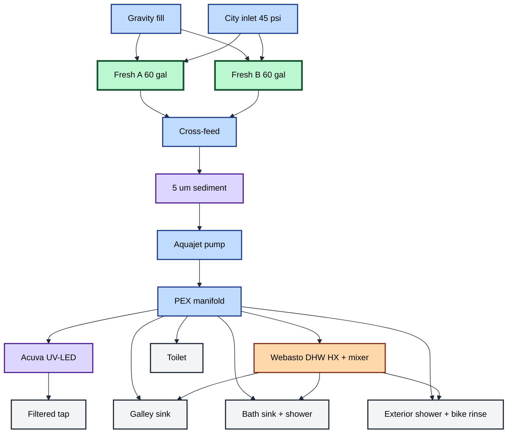
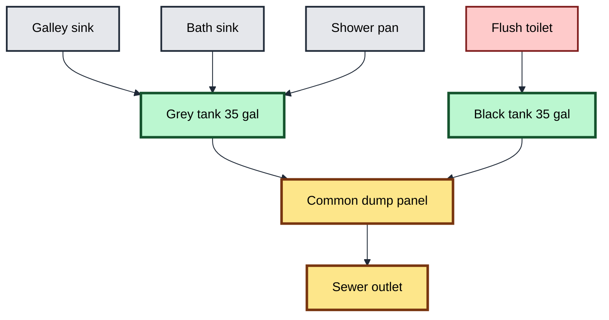
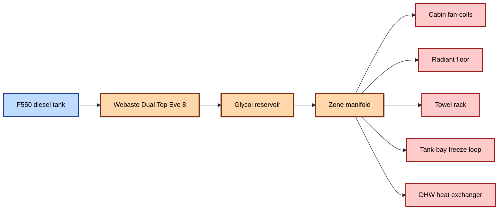

# Plumbing P&ID — DIY Earthroamer

Mermaid views render inline on GitHub. SVGs available via
`scripts/render-diagrams.sh`. ASCII detail follows for review and print.

## Fresh water — Mermaid view



## Drains — Mermaid view



## Hydronic loop — Mermaid view



## ASCII detail

Color/legend convention:
- `===` cold fresh
- `~~~` hot
- `:::` filtered (potable polish)
- `+++` grey
- `###` black
- `***` hydronic loop (heat source)

## Fresh water — supply side

```
                                                   [Gravity fill, lockable, screened]
                                                                |
                                                                v
                                                       ====[fill manifold]====
                                                          /                 \
[City water inlet]                                       /                   \
   |                                                    /                     \
[regulator 45 psi]                                     /                       \
   |                                                  /                         \
[check + back-flow preventer]                        /                           \
   |                                                v                             v
[winter blow-out tee] ====================>  [Tank A 60g, heated]         [Tank B 60g, heated]
                                                  |                              |
                                              [vent to wall]                [vent to wall]
                                                  |                              |
                                              [ball valve A]               [ball valve B]
                                                  |                              |
                                                  +------------[tee]-------------+
                                                                |
                                                            (common feed)
                                                                |
                                                                v
                                                     [Sediment 5 µm filter]
                                                                |
                                                                v
                                                        [Aquajet RV pump]
                                                                |
                                                          [accumulator]
                                                                |
                                                                v
                                                       ====[manifold]====
                                                         |   |   |   |   |
                                                         v   v   v   v   v
                                                     (to fixtures, see below)
```

## Hot water — hydronic loop

```
[Diesel — main F550 tank tap]
    |
    v
[Webasto Dual Top Evo 8]   <===  [Optional 120V AC heating element on shore]
    |       |        |
    |       |        +--->  [Cabin fan-coil A — living/galley]
    |       |        +--->  [Cabin fan-coil B — bedroom]
    |       |        +--->  [Cabin fan-coil C — bath]
    |       |
    |       +--->  [Radiant manifold]  ---> [Floor zone living/galley]
    |       |                          ---> [Floor zone bath]
    |       |                          ---> [Towel rack — bath]
    |       |
    |       +--->  [Tank-bay freeze loop — fresh A, fresh B, grey, black bays]
    |
    +--->  [DHW heat exchanger]
              |
              +-->  ~~~~~ [Mixing valve, 50°C set] ~~~~~~~~~> (to fixtures)
```

## Fixtures — distribution

```
====== cold trunk ======
   |    |    |    |    |    |
   |    |    |    |    |    +-->  Toilet supply (vacuum breaker)  ###
   |    |    |    |    +-->       Bath sink cold
   |    |    |    +-->            Galley sink cold
   |    |    +-->                 Galley filtered tap (UV)  :::
   |    +-->                      Shower cold (to thermo mixer)
   +-->                           Exterior shower cold
                                  Bike rinse hose

~~~~~~ hot trunk ~~~~~~
   |    |    |    |
   |    |    |    +-->  Bath sink hot
   |    |    +-->       Shower hot (to thermo mixer)
   |    +-->            Galley sink hot
   +-->                 Exterior shower hot
```

## Drains

```
[Galley sink]  +++>
[Bath sink]    +++>
[Shower pan]   +++>  --> [Grey trap manifold] ---> [Grey tank 35g, heated]
                                                              |
                                                              v
                                                   [3" gate valve at dump panel]
                                                              |
                                                              v
                                                   [Common 3" sewer outlet]
                                                              ^
                                                              |
[Toilet]  ###>  ----> [Black tank 35g, heated]  --> [3" gate valve, dumped after grey]
                              |
                          [Tank rinse — fresh water w/ check]
                              |
                          [Roof vent — true vent, not AAV]
```

## Tank sensors and instrumentation

| Tank | Sensor | Display |
|---|---|---|
| Fresh A | SeeLevel capacitive | RV-C → Cerbo |
| Fresh B | SeeLevel capacitive | RV-C → Cerbo |
| Grey | SeeLevel capacitive | RV-C → Cerbo |
| Black | SeeLevel capacitive | RV-C → Cerbo |
| Hydronic reservoir | Webasto OEM | Webasto control + Cerbo bridge |

## Winterization features

- Blow-out fitting at the fresh manifold (compressed air from city
  inlet side after isolating tanks).
- Antifreeze suction port at the pump inlet (siphon from RV pink jug).
- All trunk runs sloped to drain points; tagged at low spots.
- Heat-trace on exterior service-bay runs.
- Tank pads on all four wet tanks (fresh A/B, grey, black) +
  hydronic bypass loop in winter setback mode.

## Locked decisions

- Fresh: 2× 60 gal split (ADR-0015).
- Heat source: Webasto Dual Top Evo 8 (ADR-0009).
- Toilet: traditional flush + black tank (REQUIREMENTS.md §9).

## Files

- This document drives `plumbing/pid.drawio` (TBD — convert to draw.io
  once accepted).
- Tank CAD lives in `cad/50-plumbing/` (parametric macro pending).
